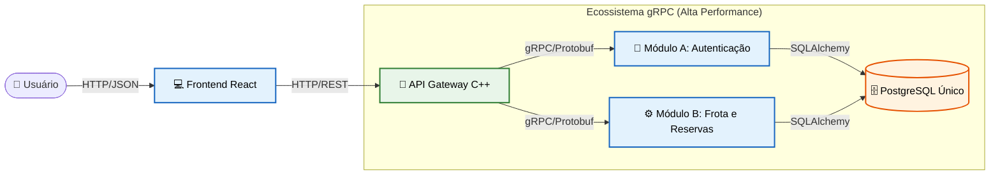

# Bem-vindo ao FrotaNext (Nova Versão)


O **FrotaNext** é uma plataforma completa e escalável de **Aluguel de Veículos (Rent-a-Car)**. 
    
Ao contrário da versão original do aplicativo. Substituímos a comunicação tradicional por um ecossistema de microsserviços de altíssima performance. 
    
Agora, o sistema conta com um **API Gateway construído em C++**  recebendo requisições web e comunicando-se via **gRPC (Protocol Buffers)** com os serviços de back-end em Python. O resultado é um ganho massivo em segurança, escalabilidade e velocidade de rede.

## A Nova Arquitetura 

O sistema foi reconstruído sobre o princípio da **separação estrita de responsabilidades** e comunicação binária de alta eficiência. 




## Pré-requisitos

Certifique-se de ter as seguintes ferramentas instaladas na sua máquina:
* [Docker e Docker Compose](https://docs.docker.com/get-docker/) (Para rodar os microsserviços e bancos de dados)
* [Node.js e npm](https://nodejs.org/) (Para rodar a interface React)
* [Python 3.x](https://www.python.org/) (Apenas para rodar o script de povoamento inicial)

---

## 🚀 Como Executar o Projeto

Siga os passos abaixo para levantar a infraestrutura completa do zero.

### 1. Levantar os Microsserviços (Backend)
Na raiz do projeto (onde está o ficheiro `docker-compose.yml`), abra o terminal e execute:

```bash
sudo docker compose up --build -d
```

Este comando irá compilar o Gateway em C++ e levantar os servidores Python nas suas respetivas portas.

###  2. Povoar o Banco de Dados (Seed)
para facilitar os testes foi feito um script para criar o primeiro Administrador e cadastrar um veículo de teste.
No terminal do seu computador instale a biblioteca requests (se não tiver) e rode o script:

```Bash
pip install requests
python seed_banco.py
```
O que este script faz?

Cria a conta Admin (admin@frotanext.com / Senha: admin).

Faz o login e captura o Token JWT.

Cria o primeiro veículo de Passeio (Honda Civic) na base de dados para permitir simulações.

### 3. Rodar o Frontend (React)
Abra um novo terminal, navegue até à pasta do seu frontend e inicie a aplicação:

```Bash
npm install
npm start
Acesse http://localhost:3000 no seu navegador.
```

### Credenciais de Acesso
Após rodar o script seed_banco.py, você pode fazer login no painel administrativo com as seguintes credenciais de teste:

Email: admin@frotanext.com

Senha: admin

### Como parar o sistema
Para desligar todos os microsserviços e o Gateway sem perder os dados do banco, volte à raiz do projeto e execute:

``` Bash
sudo docker compose stop
```